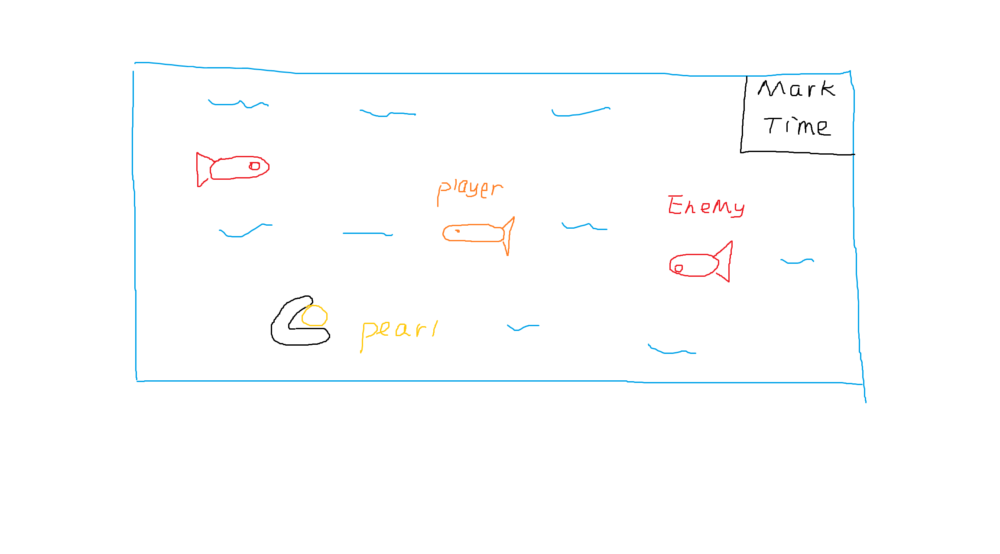

# Lost in the Depths — 2D Underwater Platformer

## What is it?

A short 2D side-scrolling platformer where the player controls a small fish navigating an underwater cave. Collect glowing pearls, avoid predators, and reach the exit portal. Simple mechanics, clear win/lose states, and minimal art assets — everything a beginner needs without scope creep.

## Player movement

Rigidbody 2D-based swimming — hold a direction to glide, release to slowly drift. Feels floaty and forgiving for testing physics.

## Collectibles (pearls)

Scatter 10–15 glowing pearl prefabs. On trigger enter, increment score and destroy the object. The score shows in a UI Text element.

## Enemies (predator fish)

Simple patrol enemy using a back-and-forth Lerp or a NavMesh2D. On contact with player, trigger a "death" state and reload the scene.

## Exit portal + win condition

A glowing portal activates once all pearls are collected. Entering it loads a "You Win" scene with final score displayed.

## Game Design

